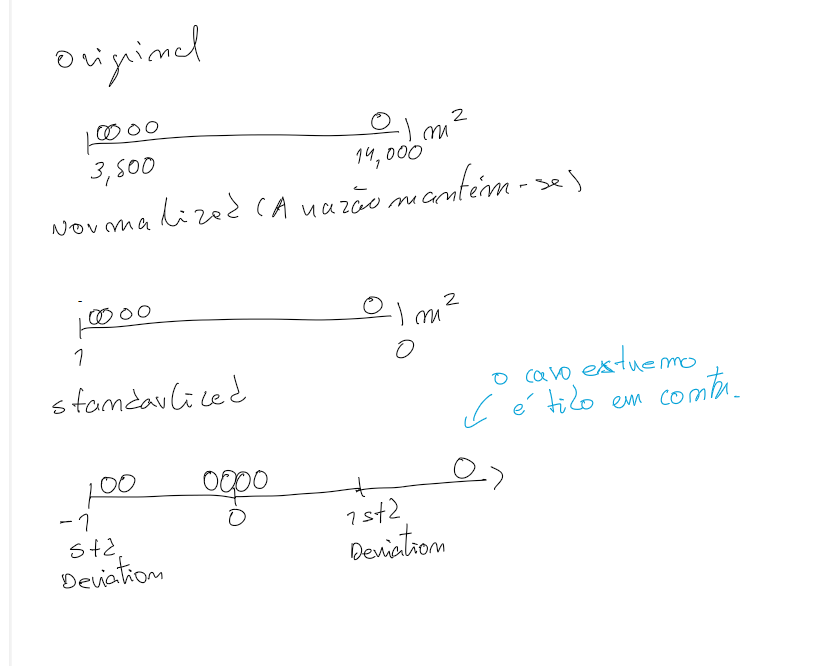

# 🧠 K-Nearest Neighbor (KNN)

KNN is a simple and intuitive machine learning algorithm where we look at **neighbor recordings** to predict the desired outcome.

---

## 🎯 Example: Plinko Game

| Drop Position | abs(dropPosition - 300) | Bucket |
|----------------|--------------------------|---------|
| 0              | 300                      | 1       |
| 150            | 150                      | 2       |

The smaller the **ABS** value, the closer that neighbor is to what we are looking for!

We **order** the data by ascending absolute value, then look at the top **K** values to predict the bucket.

> There is no fixed value for **K** — it must be chosen experimentally.

---

## ⚙️ Machine Learning Workflow

1. **Feature Selection**
2. **Feature Normalization**
3. **Features vs Labels**
4. **Train/Test Split**

---

# 🧩 TensorFlow.js (TensorJS)

Tensors are **JavaScript objects** that wrap multi-dimensional arrays and provide a variety of functions to manipulate them.

---

## 🔢 Tensor Basics

- **Dimensionality**: How many nested arrays exist.  
- **Shape**: The size of each dimension.

Examples:

```js
[1, 3, 4]              // Shape = [3]
[
  [1, 3, 4],
  [1, 3, 4]
]                      // Shape = [2, 3]
```

A **2D tensor** = Rows × Columns

---

## 🧮 Element-wise Operations

```js
const data = tf.tensor(_.range(0, 3));
const otherData = tf.tensor([4, 5, 6]);

data.add(otherData); // Also supports sub, mul, div
```

> ⚠️ Shapes must match for most operations!

---

## 🌐 Broadcasting Rules

Two tensors can be broadcast together if:

- Each compared dimension is **equal**, or
- One of them is **1**.

Examples:

✅ Works:
```
2 3 3
    1
```

❌ Does not work:
```
2 3 3
    2
```

✅ Works:
```
2 3 3
  3 1
```

❌ Does not work:
```
2 3 3
  2 1
```

---

## 🔍 Tensor Utilities

```js
tensor.print();
```

### Getting elements

```js
const data = tf.tensor([
  [10, 20, 30],
  [10, 20, 30]
]);

data.get(0, 0);
```

### Getting slices

```js
data.slice([0, 1], [-1, 1]);
// -1 gets all remaining indexes
```

---

## 🔗 Concatenating Data

```js
const data = tf.tensor([
  [10, 20, 30],
  [10, 20, 30]
]);

const data2 = tf.tensor([
  [90, 70, 30],
  [16, 90, 100]
]);

data.concat(data2, 0); // Join by rows (Y-axis)
data.concat(data2, 1); // Join by columns (X-axis)
```

> Concat requires equal dimensions!

---

## ⚠️ Matching Ranks

```js
const jumpData = tf.tensor([
  [70, 70, 70],
  [70, 70, 70],
  [70, 70, 70],
  [70, 70, 70],
]);

const playerData = tf.tensor([
  [1, 160],
  [2, 160],
  [3, 160],
  [4, 160]
]);

jumpData.sum(1).concat(playerData); // ❌ Error: rank mismatch
```

Fix with:

```js
jumpData.sum(1).expandDims(1).concat(playerData, 1);
```

---

# 📏 Calculating Distance Between Prediction Point & Features

**Steps:**
1. Find the difference between prediction point and features.  
2. Square each value.  
3. Sum across columns.  
4. Take the square root (Pythagorean theorem).

```js
const features = tf.tensor([
  [-121, 47],
  [-121.2, 46.5],
  [-122, 46.4],
  [-120.9, 46.7]
]);

const labels = tf.tensor([[200], [250], [215], [240]]);
const predictionPoint = tf.tensor([-121, 47]);

features
  .sub(predictionPoint)
  .pow(2)
  .sum(1)
  .pow(0.5);
```

### ➕ Adding Labels

```js
features
  .sub(predictionPoint)
  .pow(2)
  .sum(1)
  .pow(0.5)
  .expandDims(1)
  .concat(labels, 1);
```

---

# 🔢 Full KNN Example

```js
const features = tf.tensor([
  [-121, 47],
  [-121.2, 46.5],
  [-122, 46.4],
  [-120.9, 46.7]
]);

const labels = tf.tensor([[200], [250], [215], [240]]);
const predictionPoint = tf.tensor([-121, 47]);
const k = 2;

features
  .sub(predictionPoint)
  .pow(2)
  .sum(1)
  .pow(0.5)
  .expandDims(1)
  .concat(labels, 1)
  .unstack()
  .sort((a, b) => a.get(0) - b.get(0))
  .slice(0, k)
  .reduce((acc, pair) => acc + pair.get(1), 0) / k;
```

---

# 📊 Normalization vs Standardization

When features (like square footage) have **large differences in scale**, normalization alone may not be enough.

**Standardization** centers data around **zero** and scales based on **variance**, making models more stable.



---

## ⚗️ Applying Standardization

```js
const numbers = tf.tensor([
  [1, 2],
  [3, 4],
  [5, 6]
]);

const { mean, variance } = tf.moments(numbers, 0);

numbers.sub(mean).div(variance.pow(0.5));
```

---

🧩 **Summary**
- KNN relies on nearby data points to predict outcomes.  
- TensorFlow.js makes it easy to perform matrix math and broadcasting.  
- Standardization improves model accuracy with features of different scales.
