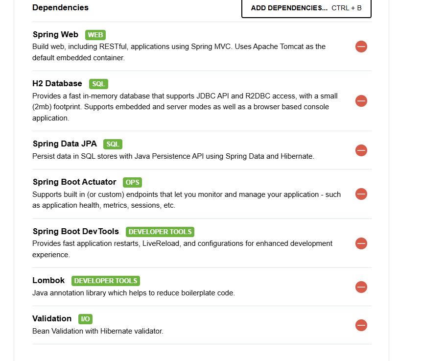

https://start.spring.io/ -> Criar um novo projeto

Dependencies for a base project

Create a rest controller with @RestController Mapping in a class

Create an endpoint by using @GetMapping in a function

Create a file with name schema.sql to create 